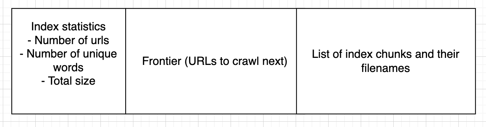
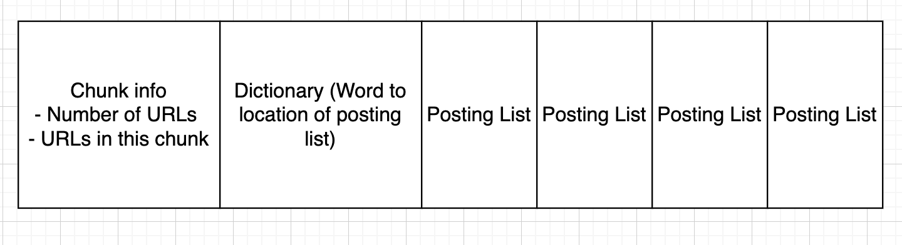
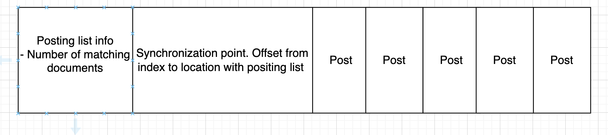
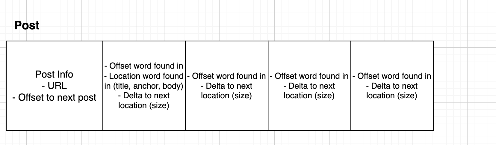
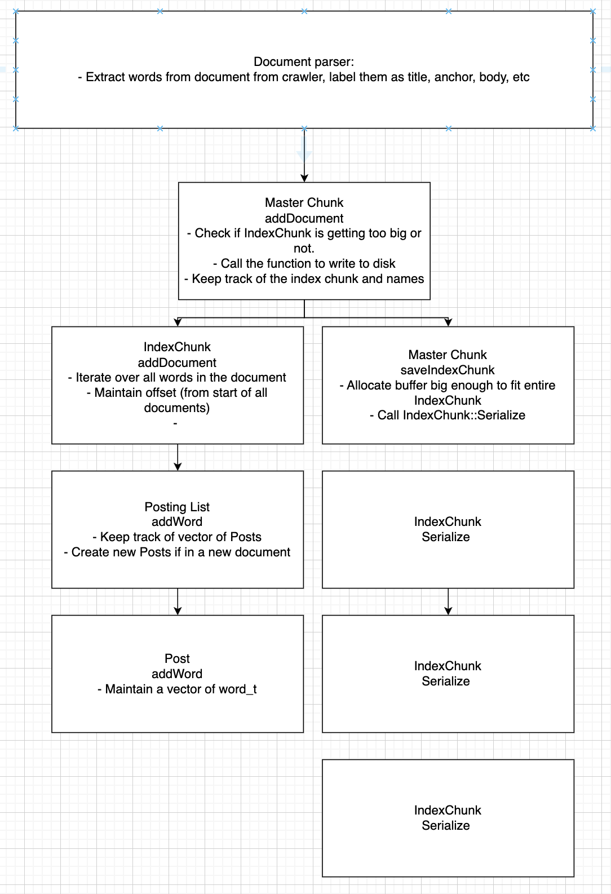

# Reindex

An inverted word index for a search engine.

Reindex takes in files parsed by a Web Crawler and builds an inverted word index out of it. 

## Build and run
```
mkdir build && cd build
// Debug build type for dev
cmake -DCMAKE_BUILD_TYPE=Debug .. 
make
./reindex
```

## Input
Reindex takes in files downloaded and parsed by a web crawler. Specify the input directory of the with the -i or --input flag
```
./reindex -i /index/in
```

Each input file should be parsed in the following format.

```
URL: ... Batch number: ...
<title>
...
</title>
<words>
...
</words>
<links>
<link>
https://www.google.com/imghp?hl=en&tab=wi
Images 
</link>
...
</links>
```

It follows a XML style formatting. 

## Index Components

### Master Index

The master index contains
- Statistics about the number of documents contained in the index
- Number of unique words
- The total size (bytes) of the index
- Frontier: URLs to crawl next
- List of index chunks and their filenames

### Index Chunk

Each index chunk is essentially one file. The index chunk is built in memory one at a time and written out to persistent storage after a certain threshold is reached. 
The index chunk contains
- The number of documents in the chunk
- The document names (urls) in the chunk
- Dictionary: Word to location of the posting list of a word 
- List of posting lists

### Posting List

The posting list is per word. It contains the documents that contain the word. 
The posting list contains
- The number of documents that contain this word
- Synchronization point: A quick way to jump to a specific word offset from the start of the index.
- List of posts

### Post

The post is per document. A word is likely to appear multiple times per document so each post represents the appearances of one word in word document.
The post contains
- Document name.
- List of word appearances that contain
    - Offset the word was found in (offset is offset out of all documents)
    - Location word found in (title, body, emphasized)

## Architecture

### Index builder
